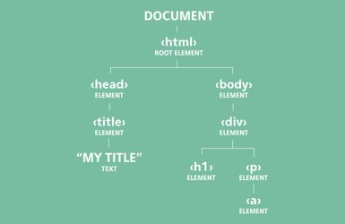

# WEEK 3
---

## TOPICS

*1. json*  
*2. dom*  
*3. flexbox*  
*4. advanced positioning*  
*5. responsive design*  
*6. yeoman*  
*7. bootstrap*

---

## MONDAY

**1. git conflict issues & commands**

**2. JAVASCRIPT OBJECT NOTATION**

*JSON (Javascript Object Notation)* is a text-based data format following javascript object syntax. JSON exist as an string and is use to transfer data across the network (between the server and the client), the data can be access for a particular use before it is converted to native javascript. 

JSON METHODS

*JSON.parse()* this method allows you to convert the data receive from the server represented as string into a javascript object.

*JSON.stringify()* this method allows you to convert the data send to the server represented as javascript object into string.

**3. EXERCISE 9**

*def:* create a json structure with a list of humans, where a human has a name, age, a list of pets,
if the human has friends or not, and a list of friends.

*notes:* at least five humans, at least one human should have a friend.

**4. DOCUMENT OBJECT MODEL**

*The (Document Object Model) DOM* is a programming interface for HTML and XML documents. It represents a document with a logical tree. Each branch of the tree ends in a node, and each node contains objects. DOM methods allow programmatic access to the tree; with them you can change the document's structure, style or content. Nodes can have event handlers attached to them. Once an event is triggered, the event handlers get executed.

The HTML DOM is compound by: 

    - HTML as objects
    - the properties of all HTML elements
    - the methods to access all HTML elements
    - the events for all HTML elements

*As Jeremy Keith said:*

> The DOM represents the web page that’s currently loaded in the browser window. The browser provides a map (or model) of the page. You can use JavaScript to read this map.

*About nodes*

Every element within the HTML tree of the DOM is a node. Higher-up branch nodes are ‘parents’, adjacent branch nodes are ‘siblings’, and lower-down nodes are ‘children’ of their ‘parent’ nodes. All nodes in the tree can be access by programs and scripts. Nodes can be created, modified or deleted.

[Video about DOM nodes](https://www.youtube.com/watch?v=BWVoPxob5DU)

#### HTML DOM TREE REPRESENTATION

#### HTML DOM DOCUMENTATION

[MDN](https://developer.mozilla.org/en-US/docs/Web/API/Document_Object_Model) |
[W3SCHOOLS](https://www.w3schools.com/js/js_htmldom.asp)

**5. exercise #10**

*def:* use he onSubmit event to get the values of the contact form

---
## TUESDAY

**1. training DOM, git**
**2. cdn**

---
## WEDNESDAY

**1. gitHub flow**

**2. flexbox**

**3. exercise #11**

*def:* build a carousel grid and carousel modal using flexbox

---
## THURSDAY

**1. layout techniques review**

**2. pages for color selection**

---
## FRIDAY

**1. advanced positioning**

**2. responsive design**

    a. css media queries
    b. disabling viewport zooming
    c. responsive images
    d. responsive image optimization
    e. retina screen

**3. exercise #12**

*def:* use responsive design in your curriculum vitae**

---
## SATURDAY

**1. setting up a yeoman project**

**2. bootstrap**

